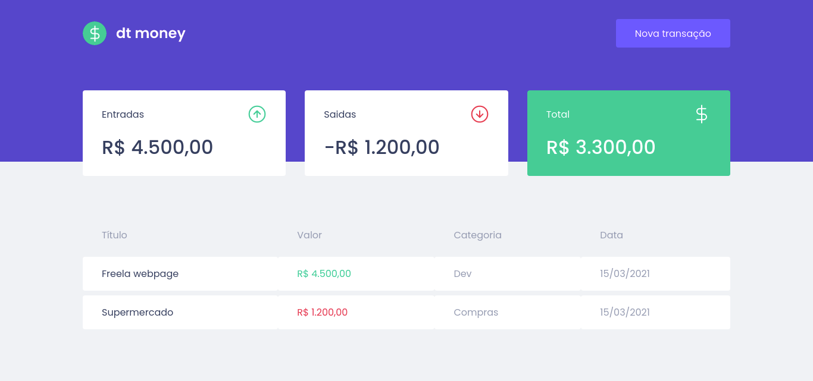

<h1 align="center">dt money</h1>

<p align="center">
	

  

  
</p>

<p align="center">
	
</p>

## 💻 Sobre 

dt money - é uma aplicação que permite organizar as despesas 


## 🧪 Tecnologias

Esse projeto foi desenvolvido com as seguintes tecnologias:

#### **Website**  ([ReactJS](https://reactjs.org/) +  [TypeScript](https://www.typescriptlang.org/) )
<br>

## 🚀 Como executar

### Pré-requisitos

Antes de começar, você vai precisar ter instalado em sua máquina as seguintes ferramentas:
[Git](https://git-scm.com), [Node.js](https://nodejs.org/en/).

#### 🧭 Rodando a aplicação

```bash

# Clone este repositório
$ git@github.com:araujo-jp/dt-money.git

# Acesse a pasta do projeto no seu terminal/cmd
$ cd dt-money

# Instale as dependências (escolha um)
$ npm install
$ yarn install

# Execute a aplicação em modo de desenvolvimento (escolha um)
$ npm run dev
$ yarn dev

# A aplicação será aberta na porta:3000
# acesse http://localhost:3000
```
## 📝 Licença

Esse projeto está sob a licença MIT. Veja o arquivo [LICENSE](./LICENSE) para mais detalhes.

---

<p align="center">Feito com :heart: by João Paulo Araújo 👋🏻</p>

---